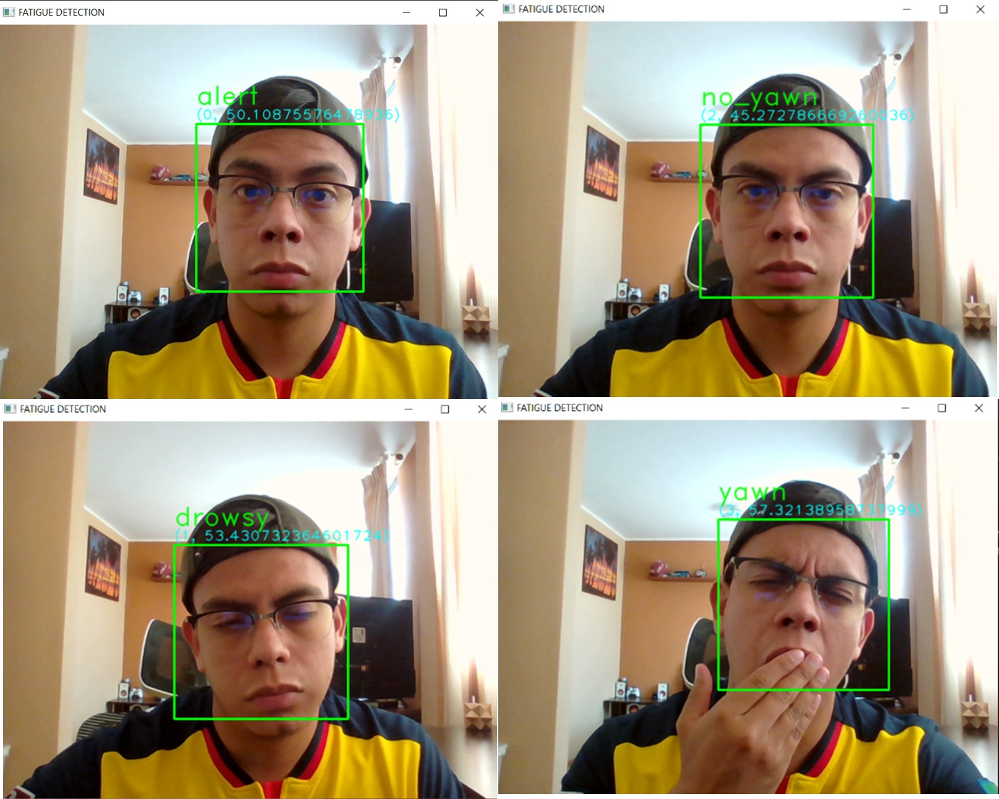

# Final_Project 🚀

## **CAR BLACK BOX**  :orange_square:

### (:eye_speech_bubble: FATIGUE DETECTION :zzz:) 

The idea of the project is to be able to recognize the gestures of tiredness or drowsiness in people who may fall asleep in inappropriate situations or moments, for example while driving. 

The objective is to recognize when the driver of a vehicle starts yawning or blinking frequently. 

#### **The Drowsy Driving Problem**
This usually happens when a driver has not slept enough, but it can also happen because of untreated sleep disorders, medications, drinking alcohol, or shift work
- Makes you less able to pay attention to the road.
- Slows reaction time if you must brake or steer suddenly.
- Affects your ability to make good decisions.

  

---
# Steps :white_check_mark:

| 1 STEP  | 2 STEP | 3 STEP  | 4 STEP | 5 STEP | 6 STEP |
|------|:------:|:------:|:------:|:------:|:------:|
| Search Dataset  | Web Scraping | Clear data | Create drowsiness dataset | Train ML  | Interface PyQt 5 |

## Related articles 📋
---
- https://arxiv.org/pdf/2112.10298.pdf
- https://iopscience.iop.org/article/10.1088/1742-6596/1090/1/012037/pdf
- https://ieeexplore.ieee.org/stamp/stamp.jsp?arnumber=8716716
- https://repositorio.upct.es/xmlui/bitstream/handle/10317/7793/tfg-gar-des.pdf?sequence=1&isAllowed=y

## DATASET 📦
---
- Driver drowsiness 
  - [Photos](https://www.kaggle.com/dheerajperumandla/drowsiness-dataset)

- Driver drowsines 
  - [Videos](http://vlm1.uta.edu/~athitsos/projects/drowsiness/?C=M;O=A)

- Cohn-kanade dataset 
  - [Emotion recognition](https://github.com/spenceryee/CS229/tree/master/CK%2B)

- DrowsyDriverDetection
  - [Photos](https://github.com/nishagandhi/DrowsyDriverDetection/tree/master/data/testing/Alert)

---
## Models :construction:
- Supervised Learning Classification
Model:
- Loss: 0.0875
- Accuracy: 0.96 

  

  

  

## RESULTS
---
### Positive Results
- Results of fatigue recognition at close range (approximately 45 cm from the camera)

 - Without glasses

  

 - With glasses

  

### Negative Results
- Results of fatigue recognition at long distance (approximately 85 cm from the camera).

 - If several errors occur in face recognition due to distance, the recognition efficiency decreases considerably. 

  

### Conclusions 
- :white_check_mark: Facial recognition metrics improve the closer you are to the camera, and ambient lighting must also be taken into account. 

- :x: Results vary when the user is wearing accessories (glasses or mask). 

- :x: Results are not optimal for users with beards.

## REQUERIMENTS 🛠️
---

  

  

  

  

  

- Keras
- OpenCV
- face-recognition
- dlib==19.18.0
- PyQt5
- opencv

## Autor ✒️
  - Andrés Carvajal
---
